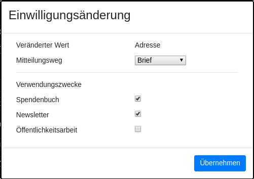
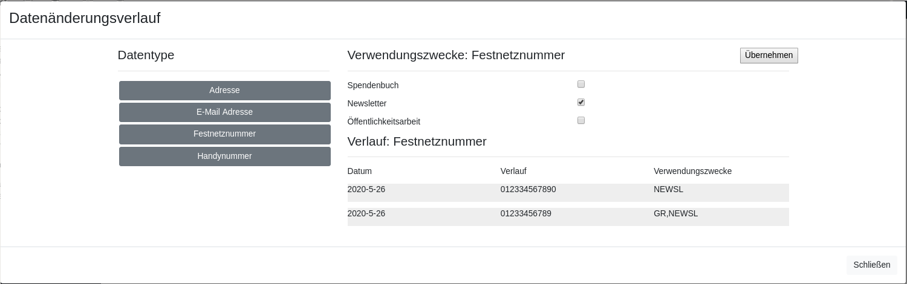

===============================
Kontakt bearbeiten
===============================

Wenn Sie einen Kontakt bearbeiten, werden Sie eventuell aufgefordert einzugeben, woher die Änderungen gekommen sind
oder für was die geänderten Informationen verwendet werden dürfen.

Dies passiert immer, wenn Sie einen Wert verändern der laut DSGVO einen Verwendungszweck braucht, um im System verarbeitet zu werden.

Sie haben auch die Möglichkeit, in der oberen rechten Ecke des Kontakt-Bearbeitungs-Fensters den Verlauf für einen Kontakt anzuzeigen,
und einzelne Daten nachzuverfolgen.
Hier können Sie auch die Verwendungszwecke anpassen, ohne neue Daten eingeben zu müssen.
Dabei sollten Sie beachten, dass auch diese Aktion protokolliert wird.

