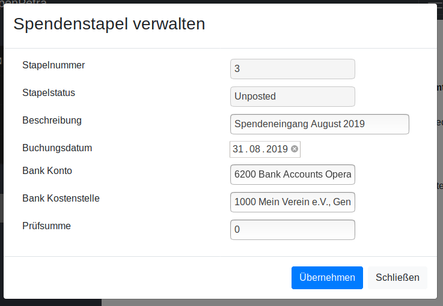
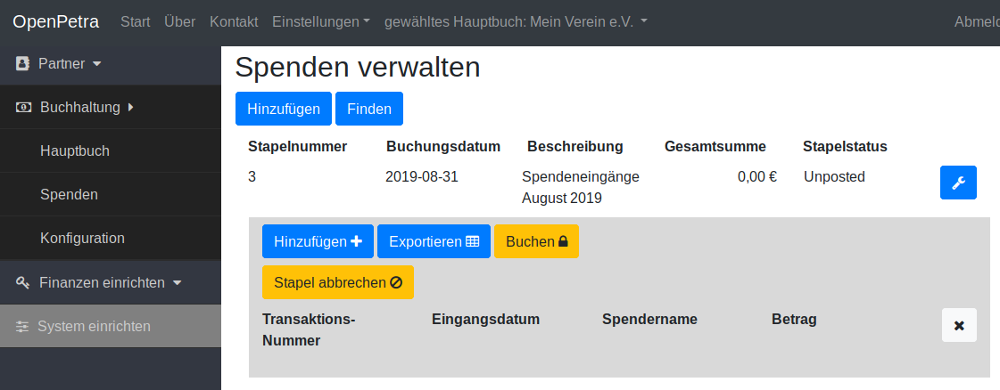
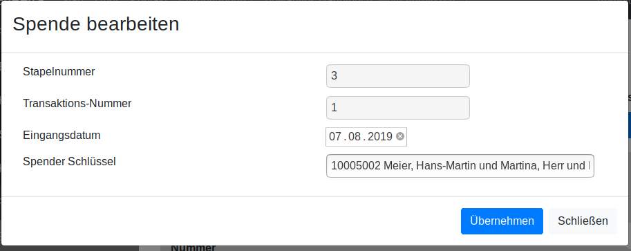
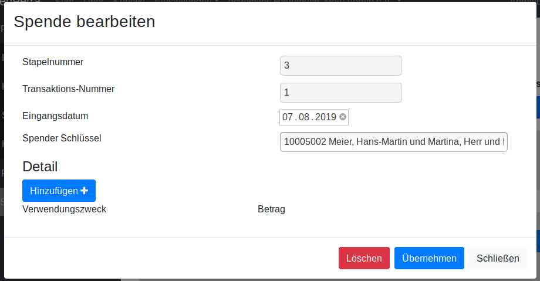
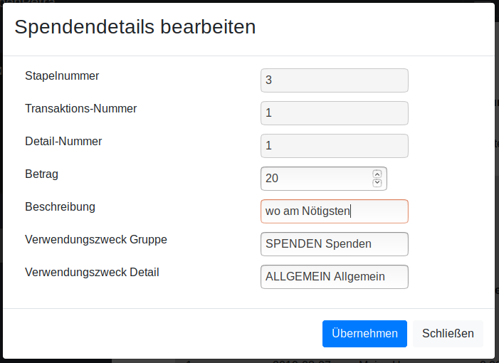
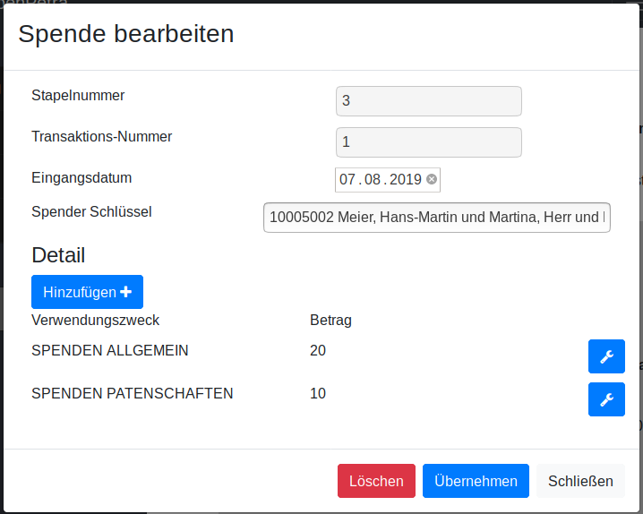
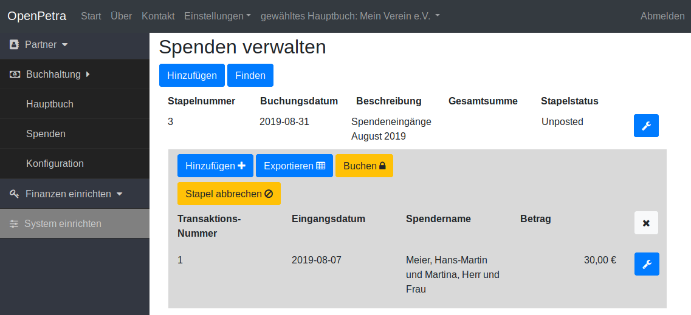
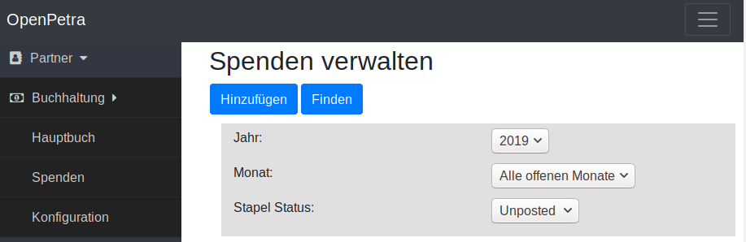
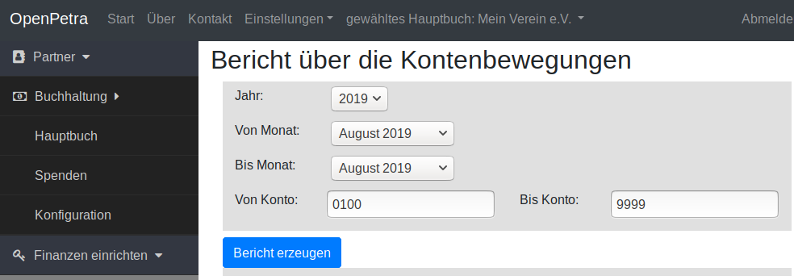
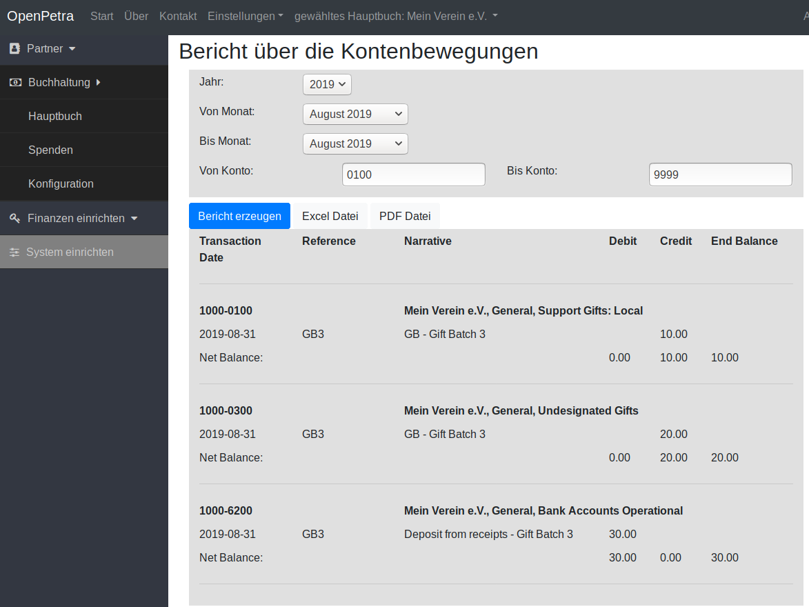

=================
Spenden verwalten
=================

Wir gehen in dieser Anleitung davon aus, dass das Hauptbuch schon eingerichtet worden ist (siehe :ref:`ein-hauptbuch-anlegen`).

Einrichtung von Projekten
=========================

Der Einrichtung des Kontenrahmens ist hier beschrieben: :ref:`kontenrahmen-einrichten`.
Für die Spendenverwaltung, könnte z.B. Konto 0100 für 'Allgemeine Spenden' dienen,
und Konto 0200 für 'Projektbezogene Spenden'.

Kostenstellen werden für bestimmte Projekte eingerichtet: siehe :ref:`kostenstellen-einrichten`.
Für die Spendenverwaltung, könnte z.B. Kostenstelle 1000 für 'Nicht zweckgebundene Spenden' dienen,
Kostenstelle 102000 für 'Projekt Mitarbeiter', Kostenstelle 103000 für 'Projekt Neues Auto 2019'.

Weiterhin müssen Verwendungszwecke eingerichtet werden: siehe :ref:`verwendungszwecke-einrichten`.
Dazu erstellt man eine Verwendungszweckgruppe, z.B. 'SPENDEN', und dann für jedes Projekt ein entsprechendes Verwendungszweckdetail.
So könnte es z.B. SPENDEN/ALLGEMEIN geben, das auf Konto 0100 und Kostenstelle 1000 verweist.
Und SPENDEN/MITARBEITER würde auf Konto 0200 und Kostenstelle 102000 verweisen.

Momentan unterstützt OpenPetra nur das Verbuchen von Spenden auf Projekte. Technisch ist OpenPetra in der Lage, auch 
Spenden auf einzelne Mitarbeiterkonten zu buchen, aber das haben wir vorerst noch nicht im Webbrowser umgesetzt.

Manuelles Erfassen von Spenden
==============================

Hier soll erstmal erklärt werden, wie man selber einen Spendenstapel anlegt, und dann Spendentransaktionen pro Spender anlegt,
mit der Möglichkeit, eine Spende auch auf verschiedene Projekte aufzusplitten.

Man kann vom Zeitraum her je nach Spendenaufkommen entscheiden, ob man einen Spendenstapel pro Tag oder pro Monat anlegen will.
Bei kleineren Vereinen (< 200 Spenden im Monat) ist es zu empfehlen, die Spenden eines Monats in nur einem Spendenstapel anzulegen.
Pro Spende wird sowieso notiert, an welchem Datum sie eingegangen ist, und dieses Datum erscheint auch auf der Spendenbescheinigung.
Das Buchungsdatum des Stapels sollte in diesem Fall auf dem letzten Tag des Monats liegen, in dem die Spenden eingegangen sind.

Über 'Buchhaltung'/'Spenden'/'Spenden verwalten' kommt man in die Übersicht der Spendenstapel. Dort auf 'Hinzufügen' klicken.

Nun legt man einen neuen Spendenstapel an:

.. _figure-gift_new_batch:

   Neuen Spendenstapel anlegen

Das Bank Konto ist das Konto, auf dem die Kontobewegungen notiert werden.
Für die doppelte Buchführung ist es wichtig, hier die Eingangsseite der Spenden festzulegen.
Bei den einzelnen Spenden wird nachher festgelegt, zu welchem Einsatzzweck die Spende gebucht wird, also wo sie landen soll.

Nun sieht man den leeren Spendenstapel:

.. _figure-gift_empty_batch:

   Leerer Spendenstapel

Hier nun auf den Schalter 'Hinzufügen' klicken, um einzelne Spenden anzulegen.

Das Eingangsdatum sollte das Datum sein, an dem die Spende auf unserem Bankkonto eingegangen ist. Dieses Datum erscheint dann auch auf der Spendenbescheinigung.

.. _figure-gift_new_gift:

   Neue Spende

Zuerst muss der Spender eingetragen werden, und mit einem Klick auf den Schalter 'Übernehmen' bestätigt werden.

Erst dann erscheint der Schalter, um auch die Verwendung der Spende zu hinterlegen.

.. _figure-gift_new_gift2:

   Gespeicherte neue Spende, bereit für Spendendetails

Nun können die Details für die Spende eingetragen werden. Jede Spende besteht aus einem oder mehreren Details.
Das bedeutet, ein Spender kann uns vorher mitteilen, oder im Verwendungszweck auf dem Kontoauszug, dass er z.B.
20 Euro für das Projekt 'Allgemein' und 10 Euro für das Projekt 'Patenschaften' spenden möchte.

.. _figure-gift_new_detail:

   Neues Spendendetail anlegen

Wenn die Spendendetails eingetragen sind, sieht das dann so aus:

.. _figure-gift_details:

   Spende mit Details

Nun klickt man auf den Schalter 'Übernehmen', und gelangt wieder in die Ansicht des Stapels.

Nach Eingabe aller Spenden kann es dann zur Buchung gehen, die weiter unten beschrieben wird.

Erfassen von Spenden mithilfe von Kontoauszug
=============================================

Es ist zu empfehlen, nicht jede Spende von Hand einzugeben.

Jede Bank bietet es an, den Kontoauszug im CSV oder CAMT Format herunterzuladen.

Momentan unterstützt OpenPetra nur die Verarbeitung im CSV Format,
aber die Unterstützung für CAMT ist schon im Prinzip fertig, und kann im Bedarfsfall freigeschaltet werden.

Man muss beim ersten Mal ein paar Einstellungen vornehmen, da jede Bank die CSV Datei etwas anders gestaltet. Dazu auf den Schalter 'Voreinstellung' klicken.

.. _figure-bankimport_settings:

.. figure:: images/bankimport_settings.png
   :scale: 50%

   Voreinstellungen für Kontoauszüge

Das Bankkonto ist ein Konto, auf dem die Spenden eingehen, und der Kontoauszug bezieht sich auf dieses Konto.

Nur Zeilen unter dieser Zeile auswerten: Hier geht es um die Zeile, ab der die eigentlichen Transaktionen verarbeitet werden sollen,
also meistens die Zeile mit den Überschriften der Spalten.

Des weiteren muss die Reihenfolge und Bedeutung der Spalten beschrieben werden.

* DateEffective: Das Datum, an dem die Spende auf dem Konto des Vereins eingegangen ist.
* unused: für Spalten, die wir ignorieren wollen.
* Description: für den Text der die Spende beschreibt. Dort enthalten ist der Name des Spenders, evtl. mit Anschrift, und Verwendungszweck.
* Amount: Der Betrag der Spende.
* Currency: Die Währung der Spende. Die Währung sollte aber mit der Grundwährung des Hauptbuches oder der Währung des Bankkontos übereinstimmen.

Die Formatierung des Datums ist in Deutschland 'tt.mm.jjjj' (Tag.Monat.Jahr), und Dezimalzahlen werden meist mit Dezimalkomma dargestellt.

Der Trenner zwischen den Werten ist üblicherweise das Semikolon, kann aber auch ein Tabulator sein.

Der Zeichensatz kann auch noch Latin-1 sein, auch wenn der UTF-8 Zeichensatz zeitgemäßer ist.
Das erkennen Sie daran, dass die Umlaute falsch dargestellt werden. Dann probieren Sie einfach den anderen Zeichensatz.

Dann auf den Schalter 'Als Voreinstellung speichern' klicken, und dann kann man wieder auf den Schalter 'Voreinstellung' klicken, um die Einstellungen verschwinden zu lassen.

Nun auf den Schalter 'Importieren' klicken, und den aktuellen Kontoauszug als CSV Datei vom lokalen Rechner wählen. Es wird automatisch der aktuelle Monat erkannt, und Kontobewegungen vom Ende des Vormonats oder vom ersten des Folgemonats werden ignoriert.

Eine Beispiel-Datei kann so aussehen: (auch zum Download zu finden: https://github.com/openpetra/openpetra/blob/master/csharp/ICT/Testing/lib/MFinance/server/BankImport/BankStatement2.csv)
::

   "Kontoumsätze Geschäfts- und Vereinskonto"

   "Kontoinhaber:";"Mein Verein e.V."
   "Kundennummer:";"1234567"

   "Umsätze ab";"Enddatum";"Kontonummer";"Saldo";"Währung"
   "01.07.2019";"31.07.2019";"1234567";"1.234,56";"EUR"
   "Weitere gewählte Suchoptionen:";"keine"

   "Buchungstag";"Wertstellungstag";"Verwendungszweck";"Umsatz";"Währung"
   "31.07.2019";"31.07.2019";"Heinrich Arndt SEPA-ÜBERWEISUNG SVWZ+ RINP Dauerauftrag Grundpatenschaft mein Patenkind";"30,00";"EUR";""
   "31.07.2019";"31.07.2019";"Werner Bastian SEPA-ÜBERWEISUNG SVWZ+ RINP Daue rauftrag Patenschaft";"30,00";"EUR";""
   "30.07.2019";"30.07.2019";"Arno Grosse SEPA-ÜBERWEISUNG SVWZ+ RINP Dauerauftrag S pende EREF+ 000000000000000 00002";"10,00";"EUR";""
   "* noch nicht ausgeführte Umsätze"

Man kann noch die Auswahl treffen bei 'Status', ob man alle Transaktionen sehen will, oder nur die erkannten Spenden, usw.
Dann auf den Schalter 'Anzeigen' klicken. 

Das sieht im Beispiel dann so aus:

.. _figure-bankimport_all:

.. figure:: images/bankimport_all.png
   :scale: 50%

   Ansicht der Kontobewegungen

Nun kann man eine Kontobewegung bearbeiten, und zuweisen, ob diese als Spende verarbeitet werden soll. Man weist den Spender zu, und den Verwendungszweck.

.. _figure-bankimport_donation:

.. figure:: images/bankimport_donation.png
   :scale: 50%

   Einordnung als Spende

Im nächsten Monat wird die Spende schon gleich wiedererkannt, und automatisch dem richtigen Spender und Verwendungszweck zugeordnet, falls sich an der Beschreibung der Kontobewegung nichts ändert.

Wenn man alle Spenden ordentlich zugeordnet hat, klickt man in der Hauptansicht auf 'Erstelle Spendenstapel aus Kontoauszug'.

Nun kann man den Spendenstapel ganz normal weiterverarbeiten, also buchen. Das ist weiter unten beschrieben.

.. _figure-bankimport_posting:

.. figure:: images/bankimport_posting.png
   :scale: 50%

   Unser importierter Spendenstapel ist bereit zum Posten

Spendenstapel buchen
====================

Über 'Buchhaltung'/'Spenden'/'Spenden verwalten' kommt man in die Übersicht der Spendenstapel.

.. _figure-gift_post_batch:

   Ein Spendenstapel ist bereit zum Posten

Dort klickt man erst auf den gewünschten Spendenstapel und dann auf den Schalter 'Buchen'.

Es sollte eine Meldung erscheinen, dass der Stapel erfolgreich verbucht wurde.

Er ist dann erstmal nicht in der Liste sichtbar, falls die Liste nur ungebuchte Spendenstapel zeigt.

Das kann über einen Klick auf den Schalter 'Finden' geändert werden:

.. _figure-gift_find_batch:

   Man kann den Filter für die Anzeige der Spendenstapel ändern.

Man kann also den Status für die Stapel von Unposted auf Posted oder Alle ändern, oder auch auf Cancelled, für abgebrochene Stapel.

Ebenfalls kann man nach Monat filtern.

Bericht: Einnahmen pro Verwendungszweck
=======================================

Wie kommt man an die Übersicht, wieviel Spenden nun für welches Projekt eingegangen sind?

Dieser Punkt kann sicherlich noch verbessert werden, aber im Moment ist es möglich, über den Bericht der Kontobewegungen diese Information zu erhalten.

Über 'Buchhaltung'/'Hauptbuch'/'Berichte' findet man den 'Bericht über die Kontenbewegungen'.

Nun können die Rahmenbedingungen für den Bericht gesetzt werden:

.. _figure-report_account_detail_parameters:

   Parameter für den Bericht einstellen

Man wählt das Jahr, und den Berichtszeitraum nach Monaten.

Außerdem wählt man, welche Konton man berücksichtigen will. Momentan werden alle Kostenstellen berücksichtigt, da gibt es keine Auswahlmöglichkeit.

Dann klickt man auf den Schalter 'Bericht erzeugen'.

Nun wird das Ergebnis angezeigt:

.. _figure-report_account_detail_result:

   Ergebnis des Berichtes

Es erscheinen nun die Schalter 'Excel Datei' und 'PDF Datei', die den Export des Ergebnisses ermöglichen.

Die Spalte, die mit Balance überschrieben ist, bezeichnet den Kontostand für die angegebene Kostenstelle.

Man sieht hier unten das Konto 6200, das unser Bankkonto darstellt, wo eine Buchung pro Spendenstapel ist.

Falls die Buchung der Spenden auf unterschiedliche Kostenstellen gegangen wäre, würde man die hier auch sehen. In diesem Beispiel war aber bei den Verwendungszwecken überall die Kostenstelle 1000 eingetragen.

Wie bereits gesagt, ist dieser Bereich noch ausbaufähig, und wir sind für Vorschläge und Beiträge offen.

Drucken der Jahresspendenbescheinigungen
========================================

TODO: die Dokumentation für die Jahresspendenbescheinigungen folgt noch!
