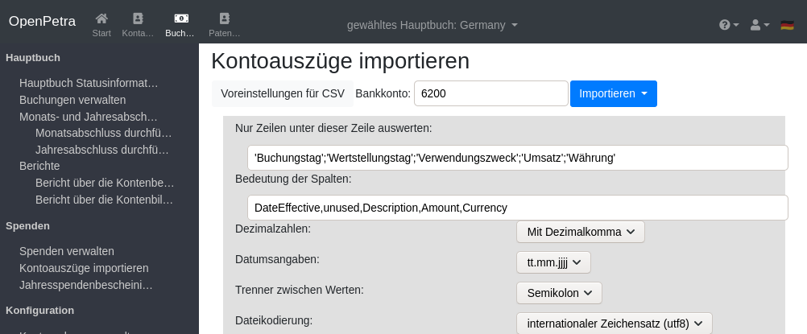

=================
Spenden verwalten
=================

Wir gehen in dieser Anleitung davon aus, dass das Hauptbuch schon eingerichtet worden ist (siehe :ref:`ein-hauptbuch-anlegen`).

Einrichtung von Projekten
=========================

Der Einrichtung des Kontenrahmens ist hier beschrieben: :ref:`kontenrahmen-einrichten`.
Für die Spendenverwaltung, könnte z.B. Konto 0100 für 'Allgemeine Spenden' dienen,
und Konto 0200 für 'Projektbezogene Spenden'.

Kostenstellen werden für bestimmte Projekte eingerichtet: siehe :ref:`kostenstellen-einrichten`.
Für die Spendenverwaltung, könnte z.B. Kostenstelle 1000 für 'Nicht zweckgebundene Spenden' dienen,
Kostenstelle 102000 für 'Projekt Mitarbeiter', Kostenstelle 103000 für 'Projekt Neues Auto 2019'.

Weiterhin müssen Verwendungszwecke eingerichtet werden: siehe :ref:`verwendungszwecke-einrichten`.
Dazu erstellt man eine Verwendungszweckgruppe, z.B. 'SPENDEN', und dann für jedes Projekt ein entsprechendes Verwendungszweckdetail.
So könnte es z.B. SPENDEN/ALLGEMEIN geben, das auf Konto 0100 und Kostenstelle 1000 verweist.
Und SPENDEN/MITARBEITER würde auf Konto 0200 und Kostenstelle 102000 verweisen.

Momentan unterstützt OpenPetra nur das Verbuchen von Spenden auf Projekte. Technisch ist OpenPetra in der Lage, auch 
Spenden auf einzelne Mitarbeiterkonten zu buchen, aber das haben wir vorerst noch nicht im Webbrowser umgesetzt.

Manuelles Erfassen von Spenden
==============================

Hier soll erstmal erklärt werden, wie man selber einen Spendenstapel anlegt, und dann Spendentransaktionen pro Spender anlegt,
mit der Möglichkeit, eine Spende auch auf verschiedene Projekte aufzusplitten.

Man kann vom Zeitraum her je nach Spendenaufkommen entscheiden, ob man einen Spendenstapel pro Tag oder pro Monat anlegen will.
Bei kleineren Vereinen (< 200 Spenden im Monat) ist es zu empfehlen, die Spenden eines Monats in nur einem Spendenstapel anzulegen.
Pro Spende wird sowieso notiert, an welchem Datum sie eingegangen ist, und dieses Datum erscheint auch auf der Spendenbescheinigung.

Erfassen von Spenden mithilfe von Kontoauszug
=============================================

Es ist zu empfehlen, nicht jede Spende von Hand einzugeben.

Jede Bank bietet es an, den Kontoauszug im CSV oder CAMT Format herunterzuladen.

Momentan unterstützt OpenPetra nur die Verarbeitung im CSV Format,
aber die Unterstützung für CAMT ist schon im Prinzip fertig, und kann im Bedarfsfall freigeschaltet werden.

Man muss beim ersten Mal ein paar Einstellungen vornehmen, da jede Bank die CSV Datei etwas anders gestaltet. Dazu auf den Schalter 'Voreinstellung' klicken.

.. _figure-bankimport_settings:

   Voreinstellungen für Kontoauszüge

Das Bankkonto ist ein Konto, auf dem die Spenden eingehen, und der Kontoauszug bezieht sich auf dieses Konto.

Nur Zeilen unter dieser Zeile auswerten: Hier geht es um die Zeile, ab der die eigentlichen Transaktionen verarbeitet werden sollen,
also meistens die Zeile mit den Überschriften der Spalten.

Des weiteren muss die Reihenfolge und Bedeutung der Spalten beschrieben werden.

* DateEffective: Das Datum, an dem die Spende auf dem Konto des Vereins eingegangen ist.
* unused: für Spalten, die wir ignorieren wollen.
* Description: für den Text der die Spende beschreibt. Dort enthalten ist der Name des Spenders, evtl. mit Anschrift, und Verwendungszweck.
* Amount: Der Betrag der Spende.
* Currency: Die Währung der Spende. Die Währung sollte aber mit der Grundwährung des Hauptbuches oder der Währung des Bankkontos übereinstimmen.

Die Formatierung des Datums ist in Deutschland 'tt.mm.jjjj' (Tag.Monat.Jahr), und Dezimalzahlen werden meist mit Dezimalkomma dargestellt.

Der Trenner zwischen den Werten ist üblicherweise das Semikolon, kann aber auch ein Tabulator sein.

Der Zeichensatz kann auch noch Latin-1 sein, auch wenn der UTF-8 Zeichensatz zeitgemäßer ist.
Das erkennen Sie daran, dass die Umlaute falsch dargestellt werden. Dann probieren Sie einfach den anderen Zeichensatz.

Dann auf den Schalter 'Als Voreinstellung speichern' klicken, und dann kann man wieder auf den Schalter 'Voreinstellung' klicken, um die Einstellungen verschwinden zu lassen.

Nun auf den Schalter 'Importieren' klicken, und den aktuellen Kontoauszug als CSV Datei vom lokalen Rechner wählen. Es wird automatisch der aktuelle Monat erkannt, und Kontobewegungen vom Ende des Vormonats oder vom ersten des Folgemonats werden ignoriert.

Eine Beispiel-Datei kann so aussehen: (auch zum Download zu finden: https://github.com/openpetra/openpetra/blob/master/csharp/ICT/Testing/lib/MFinance/server/BankImport/BankStatement2.csv)
::

   "Kontoumsätze Geschäfts- und Vereinskonto"

   "Kontoinhaber:";"Mein Verein e.V."
   "Kundennummer:";"1234567"

   "Umsätze ab";"Enddatum";"Kontonummer";"Saldo";"Währung"
   "01.07.2019";"31.07.2019";"1234567";"1.234,56";"EUR"
   "Weitere gewählte Suchoptionen:";"keine"

   "Buchungstag";"Wertstellungstag";"Verwendungszweck";"Umsatz";"Währung"
   "31.07.2019";"31.07.2019";"Heinrich Arndt SEPA-ÜBERWEISUNG SVWZ+ RINP Dauerauftrag Grundpatenschaft mein Patenkind";"30,00";"EUR";""
   "31.07.2019";"31.07.2019";"Werner Bastian SEPA-ÜBERWEISUNG SVWZ+ RINP Daue rauftrag Patenschaft";"30,00";"EUR";""
   "30.07.2019";"30.07.2019";"Arno Grosse SEPA-ÜBERWEISUNG SVWZ+ RINP Dauerauftrag S pende EREF+ 000000000000000 00002";"10,00";"EUR";""
   "* noch nicht ausgeführte Umsätze"

Man kann noch die Auswahl treffen bei 'Status', ob man alle Transaktionen sehen will, oder nur die erkannten Spenden, usw.
Dann auf den Schalter 'Anzeigen' klicken. 

Das sieht im Beispiel dann so aus:

.. _figure-bankimport_all:

.. figure:: images/bankimport_all.png
   :scale: 50%

   Ansicht der Kontobewegungen

Nun kann man eine Kontobewegung bearbeiten, und zuweisen, ob diese als Spende verarbeitet werden soll. Man weist den Spender zu, und den Verwendungszweck.

.. _figure-bankimport_donation:

.. figure:: images/bankimport_donation.png
   :scale: 50%

   Einordnung als Spende

Im nächsten Monat wird die Spende schon gleich wiedererkannt, und automatisch dem richtigen Spender und Verwendungszweck zugeordnet, falls sich an der Beschreibung der Kontobewegung nichts ändert.

Wenn man alle Spenden ordentlich zugeordnet hat, klickt man in der Hauptansicht auf 'Erstelle Spendenstapel aus Kontoauszug'.

Nun kann man den Spendenstapel ganz normal weiterverarbeiten, also buchen.

.. _figure-bankimport_posting:

.. figure:: images/bankimport_posting.png
   :scale: 50%

   Spendenstapel bereit zum Posten

Spendenstapel buchen
====================

Bericht: Einnahmen pro Verwendungszweck
=======================================

Drucken der Jahresspendenbescheinigungen
========================================
