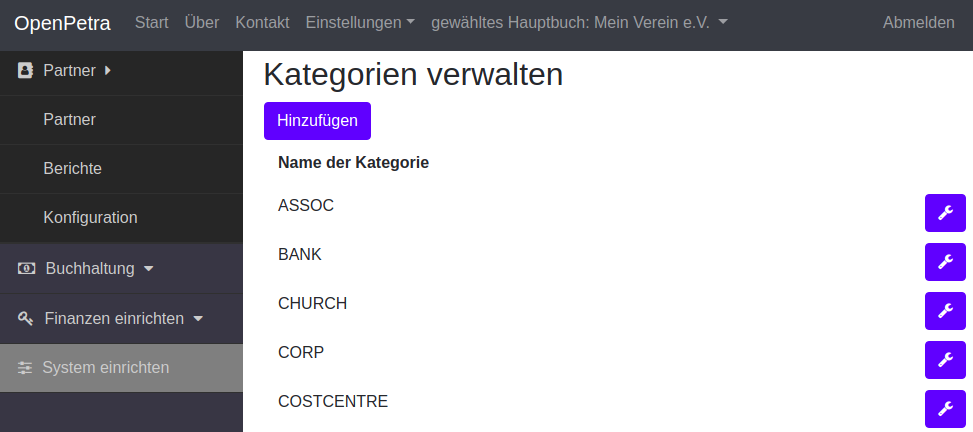
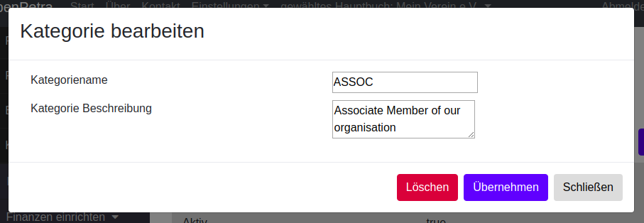
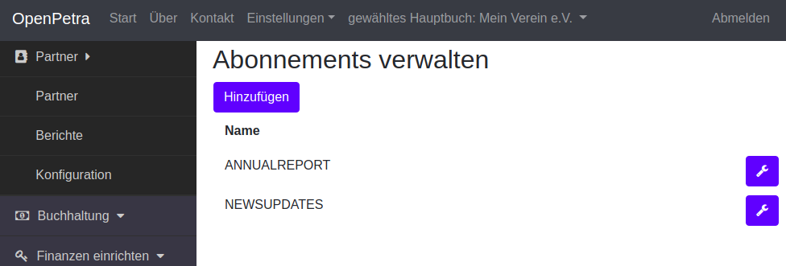
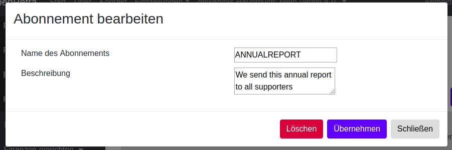

===============================
Konfiguration des Kontaktmoduls
===============================

.. NOTE::

    Baustelle: Diese Seite ist noch nicht fertiggestellt...

Kategorien verwalten
====================

Kategorien sind Merkmale, mit denen Sie Ihre Kontakte markieren und gruppieren können.

Ein Beispiel ist die Kategorie PATE, die Sie anlegen können, und dann später Ihren Kontakten zuweisen können, die eine Patenschaft übernommen haben.

Oder Sie haben eine Kategorie VEREINSMITGLIED, oder MITARBEIT.

Gehen Sie im seitlichen Menü auf *Kontakte*, und wählen *Konfiguration*, und dann wählen Sie *Kategorien verwalten*.

.. _figure-category_list:

   Kategorien verwalten

Sie können Kategorien löschen, und hinzufügen.

Der Dialog sieht so aus:

.. _figure-category_edit:

   Kategorien bearbeiten

Abonnements verwalten
=====================

Sie können Ihren Kontakten zuweisen, ob diese eine wiederkehrende Publikation erhalten möchten.

Hier können Sie die Art oder den Namen einer solchen Publikation einrichten.

Das kann ein Jahresrückblick, oder ein sonstiges regelmäßiges Rundschreiben sein.

Gehen Sie im seitlichen Menü auf *Kontakte*, und wählen *Konfiguration*, und dann wählen Sie *Abonnements verwalten*.

.. _figure-publication_list:

   Abonnements verwalten

Sie können Abonnements löschen, und hinzufügen.

Der Dialog sieht so aus:

.. _figure-publication_edit:

   Abonnement bearbeiten

Existierende Adressliste importieren
====================================

Sie haben bereits eine Liste von Adressen, die Sie gerne importieren möchten?

Datei vorbereiten
-----------------

Dazu bringen Sie die Adressen in Excel oder LibreOffice Calc in eine Form, wie sie hier dargestellt ist:

::

  "Title";"FirstName";"FamilyName";"Street";"PostCode";"City";"Country";"Email";"Mobile";"Phone"
  Herr;Arthur;Müller;"Wiesenstr. 8";"12345";"München";"DE";"mueller@gibts.net";0151-0000000000;01234-123123
  Herr und Frau;"Hans-Walter und Martina";"Meier";"Bäckerweg 3";"98765";"Frankfurt am Main";"DE";"meier@gibtsauch.net";;;

Wir unterstützen den Import von Excel Dateien und LibreOffice Calc Dateien.
Aus historischen Gründen gibt es auch noch einen CSV Textdatei Import, mit dem Trenner Semikolon (;).

Hier können Sie eine einfache LibreOffice Calc Datei als Beispiel herunterladen: https://github.com/openpetra/openpetra/raw/test/demodata/partners/samplePartnerImport.ods

Hier können Sie eine einfache Excel Datei als Beispiel herunterladen: https://github.com/openpetra/openpetra/raw/test/demodata/partners/samplePartnerImport.xlsx

Die Reihenfolge der Spalten ist nicht wichtig, dafür ist aber die Überschrift der Spalten maßgeblich.
Es können auch Spalten weggelassen werden, z.B. für die Einwilligungen oder für die Kategorien.

Wir verarbeiten momenten Spalten mit diesen Überschriften:

* Title: die Anrede, also Herr / Frau
* FirstName: Vorname
* FamilyName: Nachname
* Street: Straße mit Hausnummer
* PostCode: Postleitzahl
* City: Ort
* Country: Der Ländercode wird als 2 stelliger Code nach ISO 3166 erwartet: siehe https://en.wikipedia.org/wiki/List_of_ISO_3166_country_codes
* Email: E-Mail Adresse
* Mobile: Das ist die Handynummer
* Phone: Das ist die Festnetznummer
* Category, Category1, Category2, Category3, Category4: Kategorien für den Kontakt, z.B. SPENDER oder MITGLIED oder VORSTAND
* IBAN, IBAN1, IBAN2, IBAN3, IBAN4: IBAN Nummer des Bankkontos
* Einwilligungen: ConsentChannel1, ConsentWhen1, ConsentType1, ConsentPurpose1, und entsprechend weitere Nummerierungen (ConsentChannel2, ConsentWhen2, usw.) für weitere Einwilligungen.

   * ConsentChannel: Wie wurde die Einwilligung an uns herangetragen? Mögliche Werte siehe in der Einrichtung in OpenPetra bei Kontakte / Konfiguration / DSGVO Einwilligungskanäle: z.B. CONVERSATION, EMAIL, LETTER, PHONE
   * ConsentWhen: Das Datum, an dem die Einwilligung gegeben wurde.
   * ConsentType: Für welchen Teil der Adresse wurde diese Einwilligung gegeben. Mögliche Werte: ADDRESS (d.h. Anschrift), EMAIL (d.h. E-Mail Adresse), PHONE (d.h. Festnetznummer), MOBILE (d.h. Handynummer)
   * ConsentPurpose: Für welchen Zweck wurde die Einwilligung gegeben. Mögliche Werte siehe in der Einrichtung in OpenPetra bei Kontakte / Konfiguration / DSGVO Verwendungszwecke: z.B. GR (d.h. Spendenverwaltung), NEWSLETTER, PR (d.h. Öffentlichkeitsarbeit).

Kontakte importieren
--------------------

Nun gehen Sie im seitlichen Menü auf *Kontakte*, und wählen *Kontakte*, und dann wählen Sie *Kontakte importieren*.

Dann klicken Sie auf den Schalter mit der Beschriftung *Kontakte aus LibreOffice Calc Datei (*.ods) importieren*, bzw.
*Kontakte aus MS Excel Datei (*.xlsx) importieren*

Es öffnet sich ein Dialog, wo Sie die Datei auswählen, die Sie vorhin gespeichert haben.

Nach dem erfolgreichen Import können Sie unter *Kontakte* / *Kontakte* / *Kontakte verwalten* die Liste Ihrer Kontakte sehen.
