========================================
Konfiguration eines frischen Hauptbuches
========================================

.. NOTE::

    Baustelle: Diese Seite ist noch nicht fertiggestellt...

Wir gehen in dieser Anleitung davon aus, dass das Hauptbuch schon eingerichtet worden ist (siehe :ref:`ein-hauptbuch-anlegen`).

.. _kontenrahmen-einrichten:

Kontenrahmen einrichten
=======================

Gehen Sie im seitlichen Menü auf *Buchhaltung*, und wählen *Konfiguration*, und dann unter *Hauptbuch* wählen Sie *Kontenrahmen verwalten*.

.. _figure-account_edit:

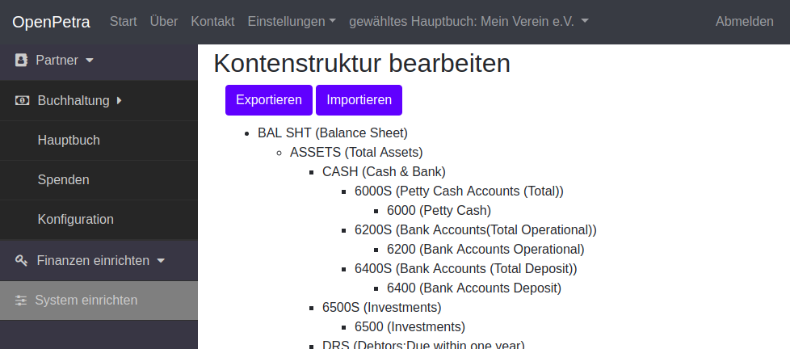

   Kontenstruktur

Sie können die Kontenstruktur in einer Text Datei exportieren, in dem Sie auf den Schalter *Exportieren* klicken. Die Datei können Sie lokal speichern, und in einem Text Editor Ihrer Wahl bearbeiten.

Sie können neue Konten einfügen, und Konten, die noch nicht bebucht sind, bearbeiten oder entfernen.

Die Datei kann dann mit dem Schalter *Importieren* wieder ins System geladen werden.

Für Vereine im deutschsprachigen Raum wird der `Kontenrahmen SKR-49 der DATEV <https://www.datev.de/web/de/datev-shop/material/kontenrahmen-skr-49-vereinestiftungenggmbh/>`_ empfohlen. Dieser Kontenrahmen steht als Datei zum Download unter https://skr49.openpetra.org/download zur Verfügung, und kann entsprechend ins OpenPetra importiert werden.

Beispiele für mögliche Anpassungen an einem SKR-49 Kontenrahmen:

* Unterhalb von ``0940-0960 Bankkonten und Schecks`` können die eigenen Bankkonten eingetragen werden.
* Wenn z.B. Ihr Verein kein Sportverein ist, können Sie Zeilen wie ``3500-3599: Zweckbetriebe Sport`` und alle darunter eingerückten Zeilen entfernen.

.. _kostenstellen-einrichten:

Kostenstellen einrichten
========================

Gehen Sie im seitlichen Menü auf *Buchhaltung*, und wählen *Konfiguration*, und dann unter *Hauptbuch* wählen Sie *Kostenstellen verwalten*.

.. _figure-costcentre_edit:

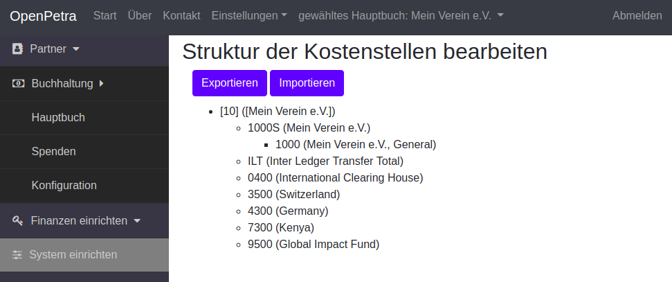

   Kostenstellen

Sie können die Kostenstellen in einer Text Datei exportieren, in dem Sie auf den Schalter *Exportieren* klicken. Die Datei können Sie lokal speichern, und in einem Text Editor Ihrer Wahl bearbeiten.

Sie können neue Kostenstellen einfügen, und Kostenstellen, die noch nicht bebucht sind, bearbeiten oder entfernen.

Die Datei kann dann mit dem Schalter *Importieren* wieder ins System geladen werden.

Eine Beispiel-Datei sieht so aus:

::

    RootNodeInternal:
        [10]:{descr=[Mein Verein e.V.], active=True, type=Local}
            1000S:{descr=Mein Verein e.V.}
                1000:{descr="Mein Verein e.V., General"}
            ILT:{descr=Inter Ledger Transfer Total}
                0400:{descr=International Clearing House, type=Foreign}
                3500:{descr=Switzerland, type=Foreign}
                4300:{descr=Germany, type=Foreign}
                7300:{descr=Kenya, type=Foreign}
                9500:{descr=Global Impact Fund, type=Foreign}

.. _verwendungszwecke-einrichten:

Verwendungszwecke einrichten
============================

Verwendungszwecke sind dazu da, um Spenden direkt einem Konto und einer Kostenstelle zuzuordnen, über ein leicht zu merkendes Kürzel.

Zum Beispiel kann man bestimmen, dass Spenden an den Verwendungszweck SPENDE/PATENSCHAFTEN immer auf die Kostenstelle 101000 Patenschaften und das Konto 0100 Patenschaften gebucht werden.

Hierbei ist SPENDE die Gruppe, und PATENSCHAFTEN das Detail.

Gehen Sie im seitlichen Menü auf *Buchhaltung*, und wählen *Konfiguration*, und dann unter *Spenden* wählen Sie *Verwendungszwecke verwalten*.

.. _figure-motivations_list:

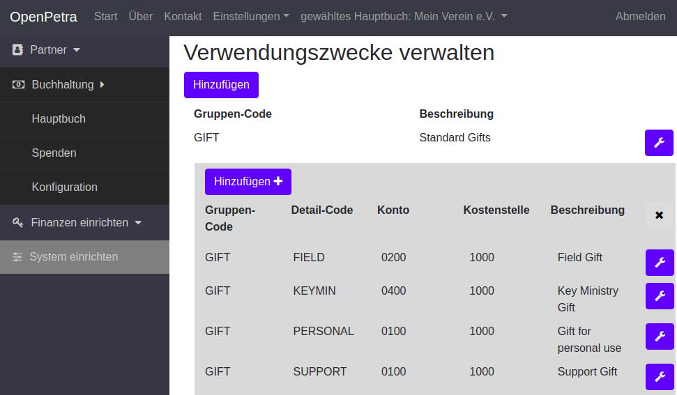

   Verwendungszwecke verwalten

Verwendungszwecke werden gruppiert, in diesem Beispiel heißt die Gruppe GIFT. Sie können die Gruppe löschen, indem Sie auf das Symbol mit dem Schraubenschlüssel klicken.

Dann erscheint dieser Dialog:

.. _figure-motivation_group_edit:

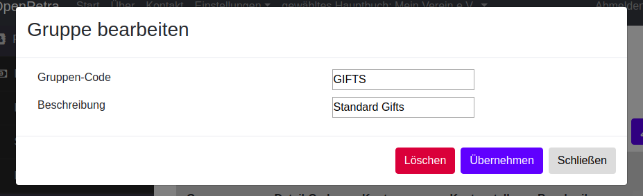

   Verwendungszweck-Gruppe bearbeiten

Um diese Gruppe und alle ihre Details zu löschen, klicken Sie den roten *Löschen* Schalter.

Nun können Sie eine neue Gruppe mit Namen SPENDEN anlegen, in dem Sie auf den Schalter mit der Beschriftung *Hinzufügen* klicken.

Um Verwendungszweck-Details einzufügen, klicken Sie auf die Gruppe, und dann klappt die Detailansicht auf. Dort ist ein weiterer *Hinzufügen* Schalter, der nun erlaubt, ein Detail anzulegen.

Der Dialog für das Hinzufügen eines Verwendungszweck-Details sieht so aus:

.. _figure-motivation_detail_add:

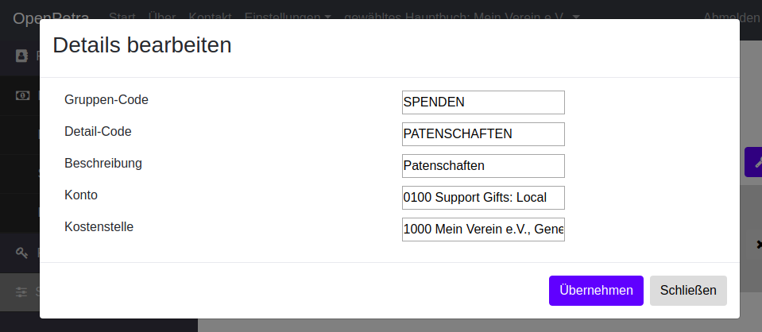

   Verwendungszweck-Detail hinzufügen

.. _startsaldo-buchen:

Startsaldo buchen
=================

Wenn Sie einen bestehenden Verein mit OpenPetra verwalten wollen, müssen die Konten mit einem Startsaldo bebucht werden.

Dazu gehen Sie im seitlichen Menü auf *Buchhaltung*, und wählen *Hauptbuch*, und dann unter *Buchungen im Hauptbuch pflegen* wählen Sie *Buchungen verwalten*.

.. _figure-gl_batches_list_empty:

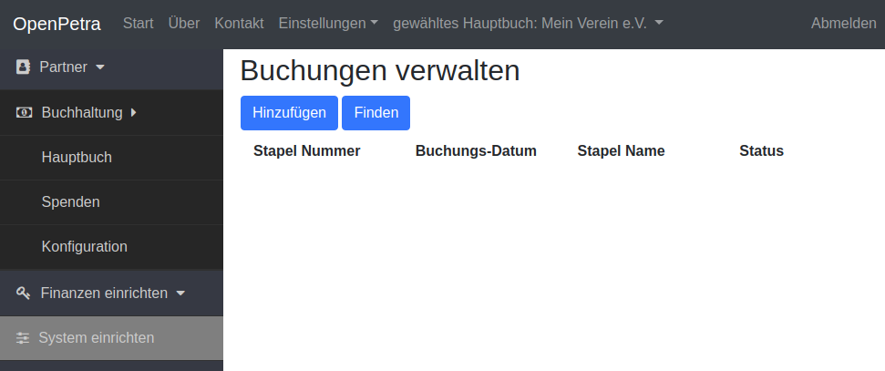

   Leere Liste der Stapel von Hauptbuch-Buchungen

Zu Anfang ist die Liste der Stapel von Hauptbuch-Buchungen noch leer.

Sie klicken nun aber auf den Schalter *Hinzufügen*, und legen einen neuen Stapel an:

.. _figure-gl_batch_add:

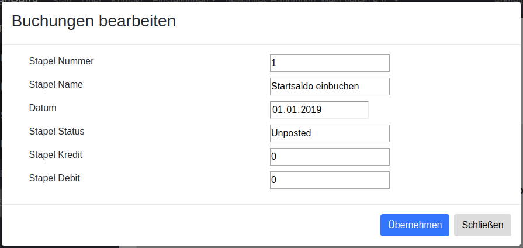

   Neuen Stapel anlegen

Die Stapelnummer ist vorgegeben, unveränderbar und fortlaufend.

Den Namen und das Datum des Stapels können Sie selber vergeben. Das Datum muss in einem offenen Monat liegen.

Wenn Sie auf den Schalter *Übernehmen* klicken, wird der Stapel angelegt. Nun klicken Sie auf den Namen des Stapels, und Sie gelangen in eine Ansicht, wo die Transaktionen innerhalb des Stapels gezeigt werden.

Das sieht dann so aus:

.. _figure-gl_transaction_list_empty:

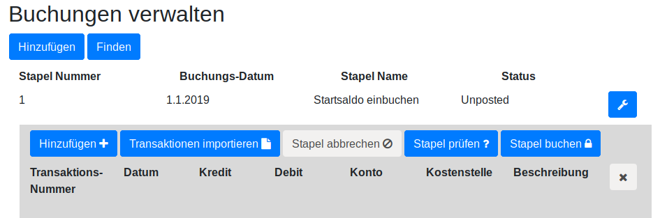

   Neuer Stapel, noch ohne Transaktionen

OpenPetra arbeitet mit doppelter Buchführung, das bedeutet es gibt zu jeder Transaktion mindestens eine Gegenbuchung. Am Ende müssen sich die Debit- und Kredit-Transaktionen gegenüber stehen und ausgleichen.

Klicken Sie nun auf den Schalter *Hinzufügen* innerhalb des Stapels, um eine Transaktion anzulegen.

Hier können Sie nun eine Transaktion anlegen, um den Kontostand auf einem der Bankkonten des Vereins zu buchen. In unserem Beispiel sind es 31088,99 Euro Haben auf dem Konto der Sparkasse. Wir müssen eine Debit-Buchung auf das Bankkonto erstellen, denn Bankkonten werden als Debitkonten geführt.

.. _figure-gl_transaction_add_debit:

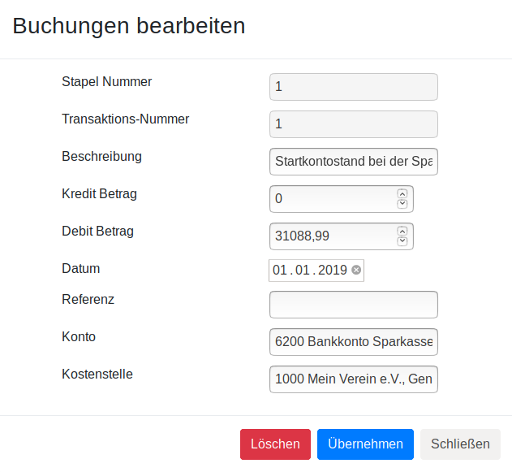

   Neue Debit-Transaktion

Nun müssen wir auch eine Gegenbuchung anlegen. Für den Übertrag von Beträgen aus dem vorherigen Jahr gibt es das Konto 9700, mit dem englischen Namen "Brought Forward 1st January", als der "Übertrag am 1. Januar". Dort buchen wir den Kredit-Betrag hin.

Natürlich kann man das Geld noch auf verschiedene andere Konten verteilen, wenn man Überträge erhalten will.

.. _figure-gl_transaction_add_credit:

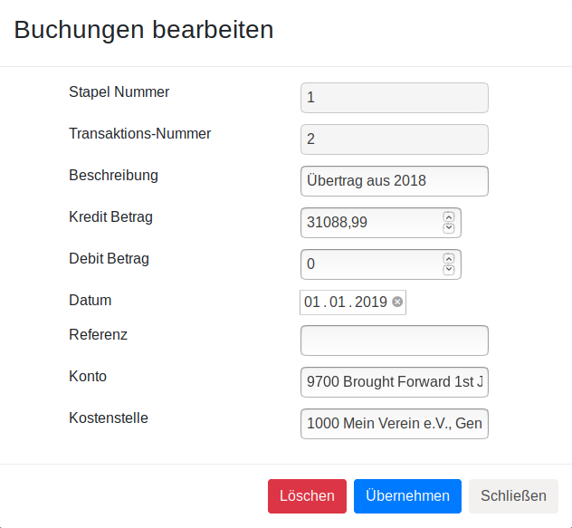

   Neue Kredit-Transaktion

Nun können Sie in der Ansicht der Transaktionsliste des neuen Stapels auf den Schalter *Stapel prüfen* klicken, um zu sehen, wie die Salden der betroffenen Konten aussehen würden, wenn Sie nun buchen würden. Das hilft, wenn man sich mit Debit und Kredit nicht so ganz sicher ist...

In unserem Fall sieht es so aus:

.. _figure-gl_test_post:

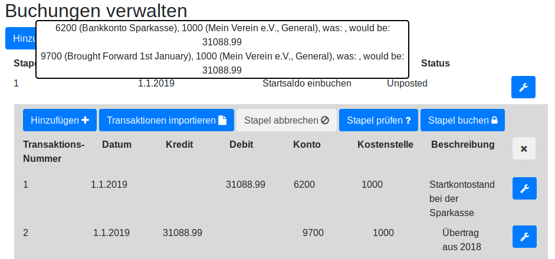

   Prüfe den Stapel und die Salden der betroffenen Konten

Das Ergebnis ist, dass wir 31088,99 Euro auf dem Bankkonto haben, und 31088,99 Euro im Übertragskonto.

Nun können Sie die Buchung tatsächlich durchführen, in dem Sie auf den Schalter *Stapel buchen* klicken.

Damit wird die Buchung durchgeführt und festgeschrieben, und evtl. Fehler können nur durch Umbuchungen korrigiert werden.

