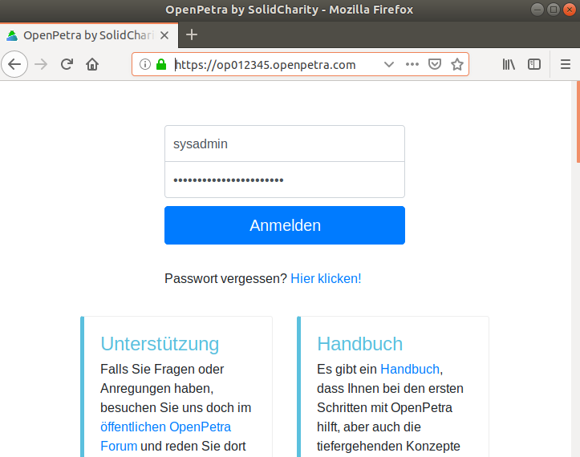
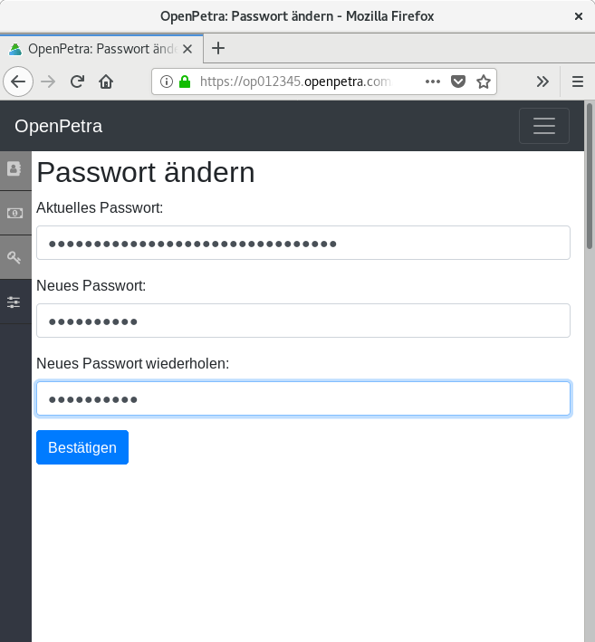
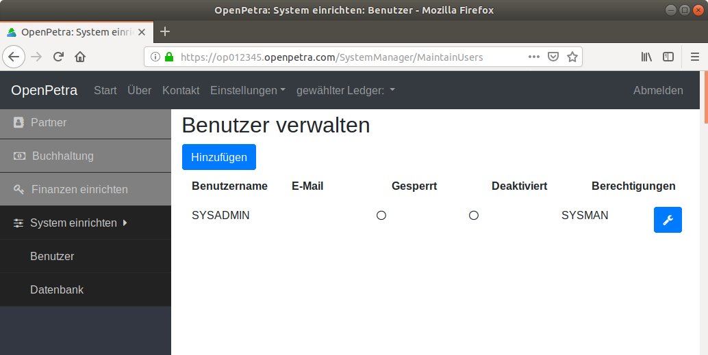
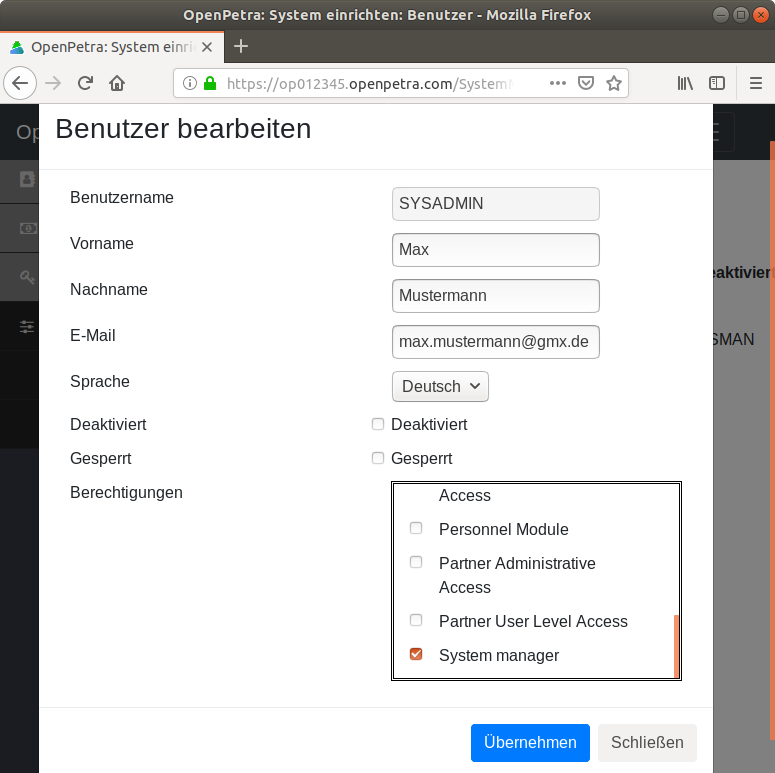
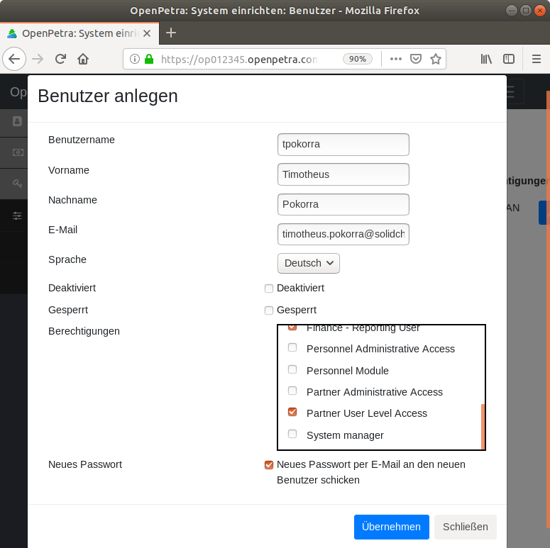
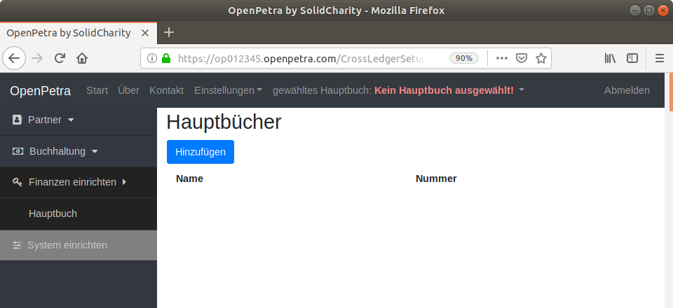
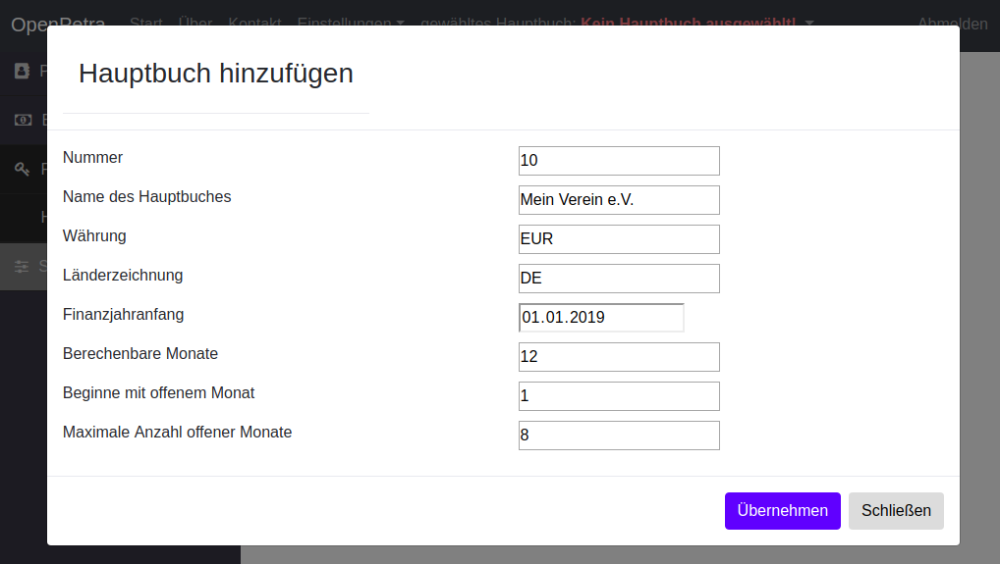
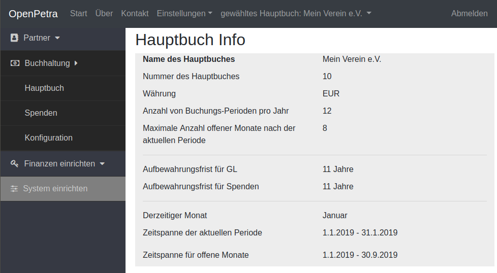

.. _initial-instance-setup:

==============================================
Konfiguration einer frischen OpenPetra Instanz
==============================================

.. NOTE::

    Baustelle: Diese Seite ist noch nicht fertiggestellt...

Wir gehen in dieser Anleitung davon aus, dass ein Dienstleister eine Instanz von OpenPetra für Sie bereitgestellt hat.
Zur Bereitstellung gehört eine **URL**, z.B. https://op012345.openpetra.com, und ein **Passwort** für den SYSADMIN Benutzer.

Anmeldung
=========

Sie melden sich also im Webbrowser auf Ihrer OpenPetra Instanz als Benutzer SYSADMIN an:

.. _figure-login_sysadmin:

   Anmeldung als Benutzer SYSADMIN

Ändern des Passworts
====================

Als nächster Schritt sollten Sie sofort das Passwort ändern, es wird auch schon direkt die Seite *Einstellungen* / *Passwort ändern* angezeigt:

Dazu müssen Sie nochmal das bereitgestellte Passwort eingeben, und dann können Sie ein eigenes Passwort eingeben:

.. _figure-change_password:

   Passwort ändern

.. _eintragen-der-email-adresse:

Eintragen der E-Mail Adresse
============================

Nun sollten Sie die E-Mail Adresse für den Benutzer SYSADMIN eintragen, damit Sie die *Passwort vergessen* Funktion verwenden können.

Dazu gehen Sie im seitlichen Menü auf *System einrichten*, und wählen *Benutzer*.

.. _figure-manage_users:

   Benutzer verwalten

Dort klicken Sie auf das Symbol mit dem Schraubenschlüssel in der Zeile von SYSADMIN, und gelangen in den Dialog zum Bearbeiten des Benutzers:

.. _figure-update_sysadmin_email:

   Benutzer bearbeiten

Dort tragen Sie Ihre E-Mail-Adresse ein, und klicken auf den Schalter *Übernehmen*.

Einen nicht-administrativen Benutzer anlegen
============================================

Es ist nicht zu empfehlen, die Tagesaufgaben in OpenPetra mit dem Benutzer SYSADMN zu erledigen. Daher hat der Benutzer SYSADMIN auch keine Berechtigungen z.B. im Partner- oder Finanz-Modul.

Stattdessen sollten Sie einen Benutzer anlegen, der auf die Finanz- und Adressdaten zugreifen darf, aber keine Rechte zum Anlegen weiterer Benutzer hat.
Selbstverständlich können Sie auch für andere Mitarbeiter in Ihrem Team weitere Benutzer anlegen.

In der Benutzerverwaltung, wählen Sie den Schalter *Hinzufügen*, um weitere Benutzer hinzuzufügen.

.. _figure-add_user:

   Benutzer hinzufügen

Es folgt dieser Dialog:

.. _figure-add_user2:

   Neuen Benutzer anlegen

Hier geben Sie den Benutzernamen, die E-Mail Adresse, ggf. den Vornamen und den Nachnamen des Benutzers, und die Berechtigungen an.

Per Voreinstellungen sind die Module *Finance - Basic User*, *Finance - Reporting User*, *Partner User Level Access* schon ausgewählt. Für den Buchhalter in Ihrem Team sollte auch *Finance - Intermediate User* und *Finance - Advanced User* gewählt werden.

Dem neuen Benutzer wird eine E-Mail zugeschickt, um den Zugang zu OpenPetra und das generierte Passwort mitzuteilen. Dieses Passwort sollte dann bei der ersten Anmeldung geändert werden.

.. _ein-hauptbuch-anlegen:

Ein Hauptbuch anlegen
=====================

Nun melden Sie sich mit dem gerade erstellten Benutzer an, um das Hauptbuch anzulegen.

Gehen Sie im seitlichen Menü auf *Finanzen einrichten*, und wählen *Hauptbuch*.

Die Liste der Hauptbücher ist erstmal leer:

.. _figure-ledger_list:

   Liste der Hauptbücher

Sie müssen für jeden Verein ein Hauptbuch anlegen, im Normalfall brauchen Sie also nur ein Hauptbuch.

Wählen Sie nun den Schalter *Hinzufügen*, um ein Hauptbuch anzulegen.

Es folgt dieser Dialog:

.. _figure-add_ledger:

   Neues Hauptbuch anlegen

Danach sollten Sie sich mit Ihrem Benutzer abmelden, und nochmal neu anmelden, um die Zugriffsrechte auf das neue Hauptbuch zu erhalten (siehe auch `Fehler 291 <https://github.com/openpetra/openpetra/issues/291>`_).

Sie können die aktuellen Daten des neuen Hauptbuches so anzeigen lassen: Gehen Sie im seitlichen Menü auf *Buchhaltung*, und wählen *Hauptbuch*, und dann unter der *Übersicht* wählen Sie *Hauptbuch Statusinformationen*.

Dann erscheint eine Ansicht wie diese:

.. _figure-ledger_info:

   Details des Hauptbuches

